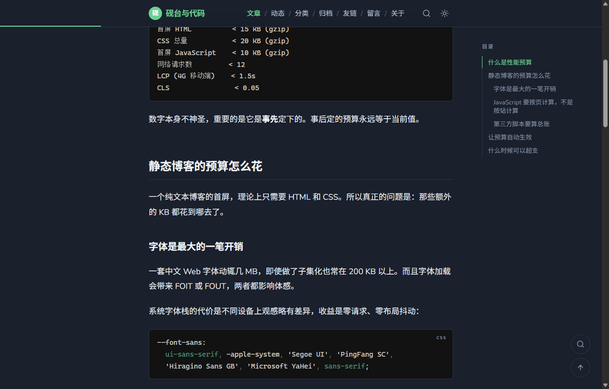

<div align="center">

# 砚台与代码

**一个为中文写作打磨的静态博客主题**

无数据库、无常驻后端，构建产物就是一堆静态文件。带网页后台、全文搜索和自动部署。

[](https://astro.build)
[](https://tailwindcss.com)
[](LICENSE)
[](https://nodejs.org)

</div>

<p align="center">
  
</p>
<details>
<summary align="center">查看深色模式</summary>
<p align="center">
  
</p>
</details>

## 为什么是这一套

- **首页 gzip 后约 7 KB，文章页约 9 KB**，一篇文章页的客户端 JavaScript 加起来只有 1 KB 左右
- **零框架运行时**，页面就是 HTML 加 CSS；深色模式、目录高亮、代码复制各自几十行，且都能单独关掉
- **阅读进度条与移动端菜单不用 JavaScript** —— 前者是 CSS 滚动驱动动画，后者是原生 `<details>`
- **排版为中文调过**：17px 字号、1.8 行高、一行约 37 个汉字，阅读时长按中英文分别计速
- **配色通过无障碍对比度校验**，各色实测值就写在 CSS 注释里
- **写作方式有三种**：网页后台、命令行、直接改文件，随便选

## 特性

| 能力 | 实现方式 |
| --- | --- |
| Markdown / MDX 写作 | Astro 内容集合 + Zod 校验 frontmatter，字段写错构建时就报错 |
| 动态（说说） | 独立内容集合，时间线展示，适合放短想法 |
| 友链 / 留言板 | 友链是内容集合，可在后台增删改；留言板复用评论区 |
| 选项卡 / 终端窗口 | MDX 组件，选项卡支持键盘操作，无 JS 时优雅降级 |
| 分类 / 标签 / 归档 | 构建时统计生成；标签横跨文章与动态 |
| 全文搜索 | Pagefind，构建时生成分块索引，支持中文分词 |
| 网页后台 | Sveltia CMS，浏览器里写作与传图，无需数据库和常驻服务 |
| 命令行 | 新建文章、通过 GitHub API 直接发布 |
| RSS / SEO | 文章 `/rss.xml`、动态 `/notes/rss.xml`、canonical、Open Graph、JSON-LD、sitemap、robots.txt |
| 深色模式 | class 策略 + 内联脚本，首屏无闪白 |
| 代码高亮 | Shiki 双主题，跟随深浅色切换，带语言标签与复制按钮 |
| 文章目录 | 桌面端浮动固定，移动端折叠，滚动自动高亮 |
| 评论 | Giscus（GitHub Discussions），滚动到可视区才加载 |
| 阅读进度条 | CSS 滚动驱动动画，零 JavaScript |
| 封面图 | 列表页缩略图 + 详情页大图，自动生成多尺寸 WebP |
| 分享图 | 从站点配置自动生成 1200×630 PNG |
| 响应式 | 320px 到 1920px 实测无横向溢出 |

## 技术栈

- **[Astro 7](https://astro.build)** —— 静态站点生成，默认不向浏览器发送框架代码
- **[Tailwind CSS 4](https://tailwindcss.com)** —— CSS-first 配置，语义化颜色令牌
- **[Pagefind](https://pagefind.app)** —— 构建时生成的静态搜索索引
- **[Shiki](https://shiki.style)** —— 与 VS Code 同源的语法高亮
- **[Sveltia CMS](https://sveltiacms.app)** —— 从 CDN 加载的 Git-based 网页后台
- **[Giscus](https://giscus.app)** —— 基于 GitHub Discussions 的评论

有意没有引入的东西：`@tailwindcss/typography`（文章排版是针对中文手写的）、任何 remark / rehype 插件（Astro 7 内置的 Sätteri 处理器已提供 GFM、智能标点和标题锚点）、任何前端框架。

## 快速开始

需要 Node.js 22.12 或更高版本。

```bash
npm install     # 安装依赖
npm run dev     # 启动开发服务器，默认 http://localhost:4321
npm run build   # 生产构建，产物在 dist/
npm run preview # 本地预览构建产物
npm run check   # TypeScript 类型检查

npm run new "文章标题"   # 新建一篇文章
npm run publish <文件>   # 通过 GitHub API 直接发布
npm run og              # 重新生成社交分享图（改过站点标题后跑一次）
```

第一次运行前，建议先把 `src/site.config.ts` 里的站点信息改成你自己的。

> **关于本地搜索**：搜索索引是在 `npm run build` 时生成的。所以在开发模式下，如果你从未构建过，搜索页会提示索引不存在。先跑一次 `npm run build` 即可，之后 `npm run dev` 也能正常搜索。

## 目录结构

```
.
├── .github/workflows/       # CI 与部署工作流
├── public/                  # 原样复制到产物根目录的静态文件
│   ├── admin/               # ★ 网页后台：改 config.yml 里的 repo 即可启用
│   │   ├── index.html
│   │   └── config.yml       # 后台的字段定义，与 content.config.ts 对应
│   ├── uploads/             # 后台上传的图片
│   ├── favicon.svg
│   ├── avatar.svg           # 首页头像
│   ├── og-default.png       # 默认分享图（由 npm run og 生成）
│   ├── og-default.svg       # 分享图的可编辑源文件
│   ├── _headers             # Cloudflare Pages 缓存策略
│   └── .nojekyll            # 让 GitHub Pages 不要用 Jekyll 处理
├── scripts/
│   ├── generate-og.mjs      # 从配置生成分享图
│   ├── new-post.mjs         # npm run new
│   └── publish-post.mjs     # npm run publish
├── src/
│   ├── site.config.ts       # ★ 站点集中配置，绝大多数改动只需要动这个文件
│   ├── content.config.ts    # 各内容集合的字段定义与校验
│   ├── assets/              # 会被优化的图片（手写文章的封面放这里）
│   │   └── fonts/           # 自托管的 Nunito 字体
│   ├── content/
│   │   ├── posts/           # 文章，.md 或 .mdx
│   │   ├── notes/           # 动态（说说）
│   │   ├── friends/         # 友情链接，每个站点一个文件
│   │   └── pages/about.md   # 「关于」页的正文
│   ├── components/          # 组件
│   ├── layouts/             # 页面骨架与文章骨架
│   ├── lib/                 # 日期格式化、内容查询、链接处理
│   ├── pages/               # 路由，文件路径即网址
│   └── styles/global.css    # 设计令牌与文章排版
├── docs/                    # README 用的预览截图，可以删
├── astro.config.ts
├── LICENSE
└── package.json
```

## 写文章

在 `src/content/posts/` 下新建 `.md` 或 `.mdx` 文件，**文件名就是网址**。例如 `my-post.md` 对应 `/posts/my-post/`。

```markdown
---
title: 文章标题
description: 一句话摘要，用于列表、搜索结果和分享卡片
pubDate: 2026-07-20
category: 技术
tags: [性能, 前端]
---

正文从这里开始。
```

### 可用字段

| 字段 | 类型 | 必填 | 默认值 | 说明 |
| --- | --- | :---: | --- | --- |
| `title` | 字符串 | 是 | —— | 文章标题 |
| `pubDate` | 日期 | 是 | —— | 发布日期，如 `2026-07-20` |
| `description` | 字符串 | 否 | 自动截取正文 | 摘要 |
| `updatedDate` | 日期 | 否 | —— | 更新日期，会显示在文末 |
| `category` | 字符串 | 否 | `未分类` | 一篇文章只能有一个分类 |
| `tags` | 字符串数组 | 否 | `[]` | 可以有多个标签 |
| `slug` | 字符串 | 否 | 文件名 | 自定义网址 |
| `cover` | 图片路径 | 否 | —— | 封面图，会被自动优化 |
| `coverAlt` | 字符串 | 否 | 文章标题 | 封面图替代文字 |
| `draft` | 布尔 | 否 | `false` | 草稿：本地可见，不参与生产构建 |
| `pinned` | 布尔 | 否 | `false` | 置顶到列表最前 |
| `toc` | 布尔 | 否 | `true` | 单篇关闭目录 |
| `comments` | 布尔 | 否 | `true` | 单篇关闭评论 |

字段写错会在构建时直接报错并指出问题所在，不会静默生成一个坏页面。

### 封面图

有封面的文章会在列表页显示缩略图，在详情页显示大图；没有封面的条目保持纯文字排版，两者混排不会错位。

封面支持两种写法：

**放 `src/assets/`（推荐，会被优化）**

```yaml
cover: ../../assets/my-cover.jpg
coverAlt: 图片说明
```

路径相对于文章文件。构建时自动生成多个尺寸的 WebP 并写入 `srcset` 与宽高 —— 示例里那张 16 KB 的 JPG，最小变体只有 2 KB。参考 `src/content/posts/markdown-typography.md`。

**放 `public/uploads/`（后台上传走这条）**

```yaml
cover: /uploads/my-cover.jpg
```

绝对路径，不会被压缩，但随传随用。子路径部署时模板会自动补上 base 前缀。

> 为什么分两种：Astro 的图片优化要求相对路径，而网页后台的 `public_folder` 必须是绝对路径，两个约束无法同时满足。所以手写文章走优化路线，后台上传走简单路线。在意体积的话，把后台传的图挪到 `src/assets/` 再改成相对路径即可。

### 草稿

`draft: true` 的文章在 `npm run dev` 下可以正常预览，但 `npm run build` 会把它完全排除，不生成页面、不进列表、归档、RSS 和搜索索引。另外文件名以 `_` 开头的文件会被内容集合直接忽略，连开发时也不加载，适合放素材片段。示例见 `src/content/posts/draft-example.md`。

### 写一条动态

有些想法不够撑起一篇文章。在 `src/content/notes/` 下建 Markdown 文件，只有 `pubDate` 一个必填字段：

```yaml
---
pubDate: 2026-07-24 21:40
mood: 随手记      # 可选，显示在时间旁
tags: [写作]      # 可选
---

正文，支持全部 Markdown 语法。
```

动态展示在 `/notes/` 的时间线上，不生成独立页面，也不进文章列表。另外：

- **标签是打通的**。给动态打的标签会和文章的标签合并统计，标签页里文章和动态分区展示 —— 所以给动态用一个文章里没有的新标签也不会 404。
- **单独一条 RSS**：`/notes/rss.xml`。主 RSS 只放文章，避免短内容把订阅列表刷满。
- **能被搜到**，但因为动态没有独立页面，Pagefind 按页建索引，所以整条时间线是一条记录 —— 搜到后会跳到 `/notes/`，需要自己在页面里定位。

### 在文章里用选项卡和终端窗口

这两个组件需要 `.mdx` 后缀。完整示例见 `src/content/posts/writing-with-mdx.mdx`。

```mdx
import Tabs from '../../components/Tabs.astro';
import TabItem from '../../components/TabItem.astro';
import Terminal from '../../components/Terminal.astro';

<Tabs>
  <TabItem label="npm">
    ```bash
    npm install
    ```
  </TabItem>
  <TabItem label="pnpm">
    ```bash
    pnpm install
    ```
  </TabItem>
</Tabs>

<Terminal title="npm run build" code={`$ npm run build
✓ Complete!`} />
```

选项卡的标签栏由脚本生成，支持左右方向键切换；没有 JavaScript 时会退化成依次列出的几段内容，各带一个小标题，信息不丢。终端窗口在浅色模式下也保持深色背景。

### 友链与留言板

友链是一个内容集合，每个站点一个文件放在 `src/content/friends/` 下，这样**网页后台也能直接增删改**：

```yaml
---
name: 某个站点
href: https://example.com
description: 一句话介绍
avatar: /uploads/avatar.png   # 可选，留空则用站名首字生成占位
order: 1                      # 数字小的排前面
---
```

页面顶部那段友链申请说明在 `src/site.config.ts` 的 `friendsNote` 里，留空则不显示。

留言板是 `/guestbook/`，直接复用文章的评论区，开启评论后即可使用。

### 几个注意点

- **文件名建议用英文或拼音**，中文文件名会让网址变成一长串百分号编码。想要中文标题配英文网址，用英文文件名即可，`title` 可以是中文。
- **文章内的站内链接请使用相对路径**，例如从 `/posts/a/` 链接到 `/posts/b/` 写作 `../b/`。Markdown 里的绝对路径 `/posts/b/` 在部署到子目录时会失效。
- **在文章里引用 `public/` 下的图片**同理，从文章页指向根目录的图片写作 `../../图片名`。
- **想用组件就把后缀改成 `.mdx`**，两种格式可以在同一目录混用。示例见 `src/content/posts/writing-with-mdx.mdx`。

## 三种写作方式

### 一、网页后台

访问 `/admin/`（本地是 http://localhost:4321/admin/ ），用表单填写标题、分类、标签、封面，正文用编辑器写，保存后自动提交到仓库并触发部署。手机浏览器也能用。

后台是 [Sveltia CMS](https://sveltiacms.app)，一个从 CDN 加载的单页应用，**不需要数据库，也不需要任何常驻服务**。

**启用前只需要改一处**：把 `public/admin/config.yml` 里的 `repo` 改成你的仓库：

```yaml
backend:
  name: github
  repo: yourname/yourrepo   # ← 改这里
  branch: main
```

登录页有三个按钮：

| 方式 | 说明 |
| --- | --- |
| **Work with Local Repository** | 直接读写本地文件夹，不需要登录也不需要联网，本地写作用这个最方便（需要 Chrome 或 Edge） |
| **Sign In Using Access Token** | 粘贴一个 GitHub 个人访问令牌就能用，**不需要架设 OAuth 服务**，适合自己一个人用 |
| Sign In with GitHub | 标准 OAuth 登录，需要额外部署一个 OAuth 中间服务，多人协作时才有必要 |

令牌在 [Settings → Developer settings → Personal access tokens](https://github.com/settings/tokens) 生成，给它当前仓库的 Contents 读写权限即可。令牌只存在浏览器本地。

**后台能管理的内容**：

| 集合 | 对应目录 | 能做什么 |
| --- | --- | --- |
| 文章 | `src/content/posts/` | 新建、编辑、删除，含封面上传与草稿开关 |
| 动态 | `src/content/notes/` | 新建、编辑、删除短内容 |
| 友情链接 | `src/content/friends/` | 增删改友链，可上传头像 |
| 独立页面 | `src/content/pages/` | 编辑「关于」页（不允许新建） |

站点标题、导航、社交链接这类配置在 `src/site.config.ts` 里，属于代码不走后台，改完需要提交一次。

> 后台的字段定义和 `src/content.config.ts` 里的 schema 是一一对应的。以后往 schema 加字段时，记得同步改 `config.yml`，否则后台存出来的内容会在构建时报错。

### 二、命令行

```bash
npm run new "给博客加个搜索" add-search
```

在 `src/content/posts/` 下生成一个填好 frontmatter 的文件。第二个参数是网址别名（也就是文件名），省略时会从标题推导 —— 中文标题推不出合适的英文名，这时会退回日期形式并提示你手动指定。

新建的文章默认是 `draft: true`，本地能预览但不会被发布，写完把它删掉即可。

```bash
npm run publish src/content/posts/add-search.md
```

调用 GitHub Contents API 直接把文件提交到仓库，CI 随后自动部署。适合在没有 git 环境的地方发布，比如手机上的自动化流程。需要的环境变量：

| 变量 | 说明 |
| --- | --- |
| `GITHUB_TOKEN` | 必填，有仓库 Contents 写权限的令牌 |
| `GITHUB_REPOSITORY` | 可选，`owner/repo`。省略时从 git remote 自动推断 |
| `GITHUB_BRANCH` | 可选，默认 `main`，也可以用 `--branch` 参数指定 |

可以一次提交多个文件（比如文章加配图），也可以用 `-m` 自定义提交信息。

### 三、直接改文件

用任何编辑器改 `src/content/posts/` 下的 Markdown，`git push` 即可。在线改的话，GitHub 仓库页面按 <kbd>.</kbd> 键能直接打开网页版 VS Code。

## 配置

打开 `src/site.config.ts`，所有配置分成八块，都有中文注释：

```ts
export const site = { url, base, title, subtitle, description, lang, timeZone };
export const author = { name, bio, avatar, url, email };
export const nav = [ /* 导航菜单 */ ];
export const social = [ /* 社交链接 */ ];
export const features = { search, toc, readingTime, codeCopy, themeToggle, postNav };
export const content = { postsPerPage, homePostCount, rssPostCount, tocDepth /* ... */ };
export const comments = { enabled, giscus: { /* ... */ } };
export const footer = { startYear, copyright, icp, note };
export const seo = { ogImage, twitterSite, sitemap };
```

部署前必须改的只有一项：**`site.url`**，它决定 RSS、sitemap 和分享卡片里的绝对地址。

### 换配色

配色定义在 `src/styles/global.css` 顶部，浅色与深色各一组语义变量：

```css
:root {
  --paper: #ffffff;   /* 背景 */
  --ink: #50616d;     /* 正文，故意不用纯黑 */
  --accent: #42b983;  /* 强调色 */
  /* ... */
}
.dark { /* 深色模式的同名变量 */ }
```

只想换主题色的话，改 `--accent` 那几个值就够了，站名、标题、链接、标签、进度条会一起跟着变，不需要动任何组件。

**几个刻意的选择**：

- 正文用蓝灰 `#50616d` 而不是纯黑，边框用极淡的 `#eef1f5`，整体没有硬边，长时间阅读不容易累。
- 强调色分成两支：`--accent` 用于**文字**（标题、链接），`--accent-vivid` 用于**图形**（站名徽标、进度条、圆点）。原因是清新的亮绿在白底上做文字只有 2.5:1 的对比度，远低于无障碍要求的 4.5:1，但作为色块完全合格。换主题色时记得同样区分这两个用途。
- `--ink-faint` 只用于图标和装饰，不要用在文字上（它只有 3.1:1，够图形不够正文）。元信息文字请用 `--ink-soft`。

浅色模式各色的实测对比度都写在 `global.css` 的注释里，改配色时可以对照。

### 关于字体

英文和数字用自托管的 Nunito（`src/assets/fonts/`，39 KB 可变字体，覆盖 400–900 全部字重），中文回落到系统黑体。不想要这个字体的话，删掉 `global.css` 里的 `@font-face` 块，再把 `--font-sans` 开头的 `'Nunito'` 去掉即可。

字体放在 `src/` 而不是 `public/`，这样 Vite 会打包并重写 URL，部署到子路径时不会 404。

### 换分享图

`public/og-default.png` 由 `npm run og` 从 `src/site.config.ts` 里的标题、副标题和域名生成，改过这些字段后重新跑一次即可。

社交平台抓取 `og:image` 时**都不支持 SVG**，所以这里必须是 PNG 或 JPG。脚本用的是 Astro 自带的 sharp，不需要额外安装东西，文字由系统字体渲染。想改设计就直接改 `scripts/generate-og.mjs` 里的模板，或者自己做一张 1200×630 的图覆盖掉输出文件。

### 换社交平台图标

`src/components/Icon.astro` 内置了 GitHub、X、微博、知乎、B 站、掘金、Telegram、邮箱、RSS 等图标。要加新的，从 [Simple Icons](https://simpleicons.org) 复制 path 数据加进 `ICONS` 对象，再到 `site.config.ts` 的 `IconName` 里补上名字即可。

## 开启评论

评论用 Giscus，数据存在你自己仓库的 GitHub Discussions 里，不需要任何后端。

1. 仓库必须是 **public**
2. 到仓库 `Settings → General → Features`，勾选 **Discussions**
3. 给仓库安装 [giscus app](https://github.com/apps/giscus)
4. 打开 [giscus.app/zh-CN](https://giscus.app/zh-CN)，填入仓库名，页面下方会生成一段配置，从里面抄出 `data-repo-id` 和 `data-category-id`
5. 填进 `src/site.config.ts` 并把开关打开：

```ts
export const comments = {
  enabled: true,
  giscus: {
    repo: 'yourname/yourrepo',
    repoId: 'R_kgDO...',
    category: 'Announcements',
    categoryId: 'DIC_kwDO...',
    // ...
  },
};
```

评论区默认懒加载：只有用户滚动到接近评论区时才会加载 iframe，不影响文章页的首屏性能。深浅色切换时评论主题会自动跟随。

## 部署

产物是纯静态文件，两个平台都不需要付费。

### Cloudflare Pages（推荐，部署在根路径）

最简单的方式是让 Cloudflare 直接连接仓库：

1. 把代码推送到 GitHub / GitLab
2. Cloudflare 控制台 → **Workers 和 Pages** → **创建** → **Pages** → **连接到 Git**
3. 选择仓库，构建配置填：

   | 项目 | 值 |
   | --- | --- |
   | 框架预设 | Astro |
   | 构建命令 | `npm run build` |
   | 构建输出目录 | `dist` |
   | Node 版本 | 环境变量加 `NODE_VERSION` = `22` |

4. 可选：加环境变量 `SITE_URL`，值为你的最终域名

之后每次推送 `main` 分支都会自动部署。这种方式不需要 `.github/workflows/deploy-cloudflare.yml`，可以把它删掉。

如果你更希望用 GitHub Actions 主动推送产物，那就保留那个工作流，并在仓库配置：

- 变量（Variables）：`CLOUDFLARE_PROJECT_NAME`、`SITE_URL`
- 密钥（Secrets）：`CLOUDFLARE_API_TOKEN`、`CLOUDFLARE_ACCOUNT_ID`

没配置 `CLOUDFLARE_PROJECT_NAME` 时这个工作流会自动跳过，不会让 CI 变红。

### GitHub Pages（自动处理子路径）

1. 把代码推送到 GitHub
2. 仓库 `Settings → Pages`，把 **Source** 设为 **GitHub Actions**
3. 推送到 `main` 分支即可

`.github/workflows/deploy-github-pages.yml` 会自动处理子路径问题：它从 `actions/configure-pages` 读取实际的部署地址，把 `SITE_URL` 和 `BASE_PATH` 注入构建。

- 部署到 `user.github.io/blog/` 时，`BASE_PATH` 自动为 `/blog`
- 绑定了自定义域名时，`BASE_PATH` 自动为空

所以你不需要手改任何配置。

> **子路径部署的一个限制**：`robots.txt` 只在站点根目录生效。部署在 `user.github.io/blog/` 时它会落在 `/blog/robots.txt`，搜索引擎不会读取。如果在意这点，用自定义域名或 Cloudflare Pages 部署到根路径。sitemap 不受影响，因为它的地址写在页面的 `<link>` 里。

### 本地验证子路径部署

```bash
BASE_PATH=blog SITE_URL=https://user.github.io npm run build
npm run preview
```

Windows 的 Git Bash 会把以 `/` 开头的值当成路径改写（`/blog` 会变成 `C:/Program Files/Git/blog`），所以这里写不带斜杠的 `blog`。配置代码会自动补全成 `/blog/`。

### 部署到其他平台

产物在 `dist/`，任何静态托管都能用：Vercel、Netlify、Nginx、对象存储 + CDN。只需要保证：

- 构建命令 `npm run build`，输出目录 `dist`
- 404 页面指向 `404.html`
- 如果部署在子路径，构建时设置 `BASE_PATH`

## 常见问题

**搜索没有结果？**
索引在构建时生成。本地开发前先跑一次 `npm run build`。部署后如果搜索报错，检查 `dist/pagefind/` 是否被正确上传。

**深色模式切换时闪白？**
主题初始化脚本必须是内联且阻塞的，它在 `src/components/BaseHead.astro` 末尾。不要把它改成外部脚本或加 `defer`。

**改了文章但页面没更新？**
`npm run dev` 支持热更新。如果卡住，删掉 `.astro/` 目录再启动。

**分类页的网址是一串百分号编码？**
这是中文路径的正常编码，浏览器地址栏会显示成中文，可以正常访问和分享。如果想要英文网址，把 `category` 和 `tags` 改成英文即可。

**想加访问统计？**
优先选择不需要在页面里插脚本的方案（Cloudflare Web Analytics、服务端日志分析）。如果一定要插脚本，加在 `src/layouts/BaseLayout.astro` 的 `</body>` 前，并注意它会影响性能预算。

**想改文章正文的排版？**
所有 `.prose` 开头的规则都在 `src/styles/global.css` 里，按元素分组，可以直接改。

**后台保存后网站没变？**
后台是把改动提交到 Git 仓库，需要等 CI 构建完成，通常一到两分钟。可以到仓库的 Actions 页面看进度。

**能不要那个绿色吗？**
改 `src/styles/global.css` 里的 `--accent` 系列即可。注意区分 `--accent`（文字用，需要 4.5:1 对比度）和 `--accent-vivid`（图形用），详见「换配色」一节。

## 开始用之前的检查清单

- [ ] 改 `src/site.config.ts`：`site.url`、站点标题、作者信息、社交链接
- [ ] 跑一次 `npm run og` 重新生成分享图
- [ ] 换掉 `public/favicon.svg` 和 `public/avatar.svg`
- [ ] 删掉 `src/content/posts/` 下的示例文章、`src/content/notes/` 下的示例动态、`src/content/friends/` 下的示例友链
- [ ] 改写 `src/content/pages/about.md`
- [ ] 想用网页后台的话，改 `public/admin/config.yml` 里的 `repo`
- [ ] 想开评论的话，按「开启评论」一节配置 Giscus
- [ ] 把 `LICENSE` 里的版权人改成自己
- [ ] 删掉 `docs/` 下的预览截图（那是这个仓库的说明图，不是你的内容）

## 致谢

- 视觉风格参考了 [NIE-Higan-Blog](https://github.com/3257085208/NIE-Higan-Blog) 的清爽配色思路（代码为本项目独立实现）
- 拉丁字体是 [Nunito](https://fonts.google.com/specimen/Nunito)，采用 SIL Open Font License 1.1
- 搜索、后台、评论分别由 [Pagefind](https://pagefind.app)、[Sveltia CMS](https://sveltiacms.app)、[Giscus](https://giscus.app) 提供

## 许可证

代码采用 [MIT](LICENSE) 授权，可自由使用、修改与再分发，记得把 `LICENSE` 里的版权人换成你自己。

字体文件单独采用 SIL Open Font License 1.1（见 `src/assets/fonts/OFL.txt`）。

示例文章、示例动态、示例友链和 `public/` 下的占位图都只作演示，正式使用前请替换。页脚那行 CC 协议声明在 `src/site.config.ts` 的 `footer.note` 里，记得改成你实际采用的授权方式。
